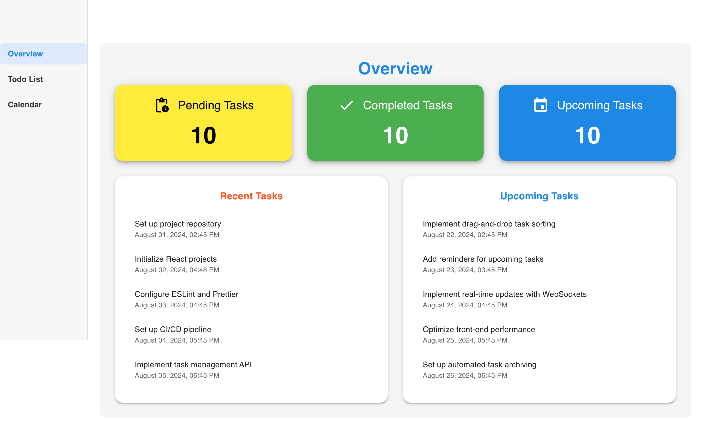
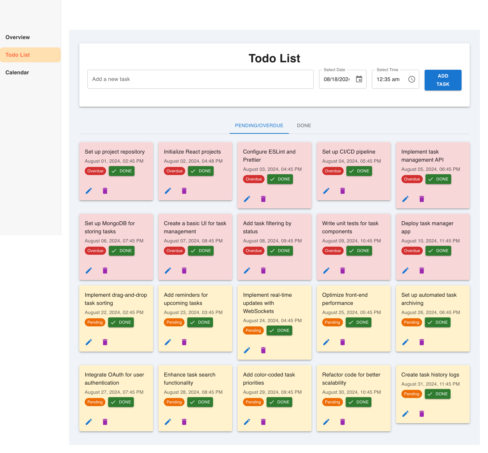
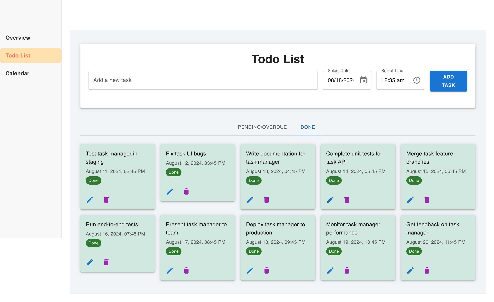
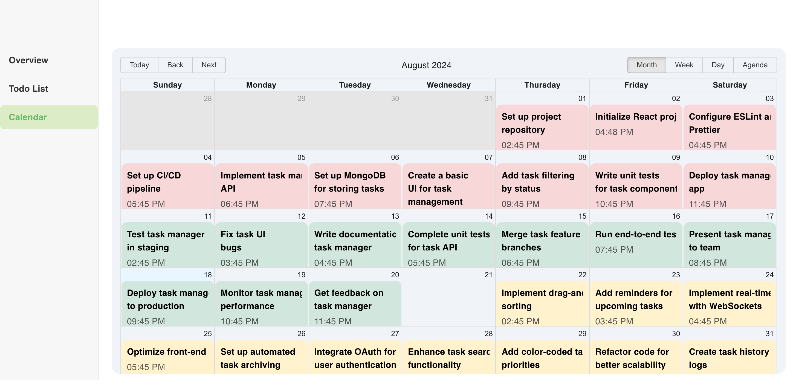

# Todo Application

This is a Todo List and Calendar application built with React.js and Material-UI. The application allows users to create, edit, delete, and mark tasks as done. Users can view their tasks in a list or calendar view. Tasks are categorized as `Pending`, `Overdue`, or `Done` based on their date and status. Additionally, tasks can be managed using a modal popup for editing. The application also shows the Nepali date alongside the standard date for each task in both the Todo List and Calendar views.

## Screenshots

Below are some screenshots of the application, including the Overview page, Todo List (with Pending/Overdue and Done tasks), and Calendar view.

### Overview Page

This page provides a summary of all tasks categorized as Pending, Done, and Overdue.



### Todo List - Pending/Overdue and Done Tasks

The Todo List page allows users to view tasks under two tabs: `Pending/Overdue` and `Done`. Users can add new tasks, edit existing tasks, and mark tasks as done.

#### Pending/Overdue Tasks



#### Done Tasks



### Calendar View

The Calendar view displays all tasks on their respective dates. Tasks are color-coded based on their status. Additionally, the calendar shows both the standard date and the Nepali date for each task.



## Features

- **Add Task**: Users can add new tasks with a name, date, time, and Nepali date.
- **Edit Task**: Tasks can be edited in a modal popup.
- **Delete Task**: Users can remove tasks from the list or calendar.
- **Mark as Done**: Users can mark tasks as done, updating their status.
- **View Tasks**: Users can view tasks in either a list or calendar view.
- **Filter by Status**: Tasks can be filtered by their status (`Pending`, `Overdue`, `Done`).
- **Nepali Date Display**: All tasks display the Nepali date along with the standard date.

## Technologies Used

- **React.js**: JavaScript library for building user interfaces.
- **Material-UI**: React component library for building responsive, modern UIs.
- **Date-fns**: Modern date utility library for JavaScript.
- **React-Big-Calendar**: Calendar component for displaying events.
- **Nepali Date Converter**: Library for converting dates into the Nepali calendar.

## Project Structure

```
backend/
│   └── server.js           # Backend server for managing tasks
│   └── tasks.json          # Task data file
frontend/
│   ├── src/
│   │   ├── components/
│   │   │   ├── TodoApp.js        # Main component for the Todo list
│   │   │   ├── TodoCalendar.js   # Calendar component for displaying tasks in a calendar view
│   │   │   ├── Sidebar.js        # Sidebar component for navigation
│   │   │   ├── Overview.js       # Overview component for summary of tasks
│   │   └── App.js                # Root component that manages view switching
│   │   └── index.js              # Application entry point
└── package.json                  # Main package file
```

## Functions and Usage

### `TodoApp.js`

This component handles the following functionality:

- **`handleAddTodo`**: Adds a new task based on user input. The task is created with a name, date, time, Nepali date, and an initial status (`Pending` or `Overdue` based on the task's date).
- **`handleEditTodo`**: Opens the edit modal to allow users to modify the selected task's details.
- **`handleSaveEdit`**: Saves the edited task details from the modal.
- **`handleTaskUpdated`**: Updates a task's status or content (e.g., marking a task as done).
- **`handleTaskDeleted`**: Deletes a task from the list.
- **`handleTabChange`**: Handles switching between the `Pending/Overdue` and `Done` tabs.

### `TodoCalendar.js`

This component handles tasks in the calendar view:

- **`handleSelectSlot`**: When a date is selected in the calendar, a modal opens to add a new task for that date.
- **`handleOpenModal`**: Opens the modal for editing or adding a task.
- **`handleSaveEdit`**: Saves the edited or newly added task from the modal.
- **`eventStyleGetter`**: Styles the tasks in the calendar based on their status (`Pending`, `Overdue`, or `Done`). Additionally, the Nepali date is displayed alongside the standard date.

### `Sidebar.js`

This component is responsible for navigation between views:

- **`handleViewChange`**: Updates the active view (`overview`, `todoList`, `calendar`) and triggers a view change in the parent component (`App.js`).

### `Overview.js`

This component shows a summary of tasks and categorizes them by `Pending`, `Done`, and `Overdue`.

## Running the Application

### Prerequisites

- **Node.js**: Ensure you have Node.js installed on your system. You can download it [here](https://nodejs.org/).

### Installation

1. Clone the repository:

   ```bash
   git clone https://github.com/yourusername/todo-app.git
   cd todo-app
   ```

2. Install dependencies:

   ```bash
   cd backend
   npm install
   cd ..
   cd frontend
   npm install
   cd ..
   npm install
   ```

3. The application uses the `concurrently` package to run both the backend and frontend simultaneously.

### Running the Application

1. Start the development server:

   ```bash
   npm start
   ```

2. This will start both the backend and frontend servers concurrently. The frontend will be available at:

   ```
   http://localhost:3000
   ```

   The backend will be available at:

   ```
   http://localhost:5001
   ```

### Backend API

This project integrates with a backend API for storing tasks. The API exposes the following routes:

- **`GET /tasks`**: Fetch all tasks.
- **`POST /tasks`**: Create a new task.
- **`PUT /tasks/:id`**: Update a task by ID.
- **`DELETE /tasks/:id`**: Delete a task by ID.

Ensure your backend server is running on port `5001`, or update the API endpoint URLs in the frontend project accordingly.

## Explanation of Key Decisions

### Why Material-UI?

Material-UI was chosen to quickly build responsive, visually appealing components without needing to create everything from scratch. Its flexibility and pre-built components make development faster and the UI modern.

### Why React-Big-Calendar?

React-Big-Calendar was used for its simplicity in rendering calendar views and handling events. It allows for easy customization, and tasks can be displayed in a structured manner, supporting multiple views like month, week, and day.

### Why Date-fns?

Date-fns was selected for its lightweight and modular design, allowing easy formatting, parsing, and manipulation of dates.

### Why Nepali Date Converter?

Nepali Date Converter was added to provide local users with the convenience of viewing dates in the Nepali calendar, enhancing the user experience for the local audience.

## Future Enhancements

- **User Authentication**: Add user login and authentication to store and manage tasks for individual users.
- **Task Notifications**: Add a notification system to alert users of upcoming or overdue tasks.
- **Task Priorities**: Add priority levels (e.g., low, medium, high) for tasks.